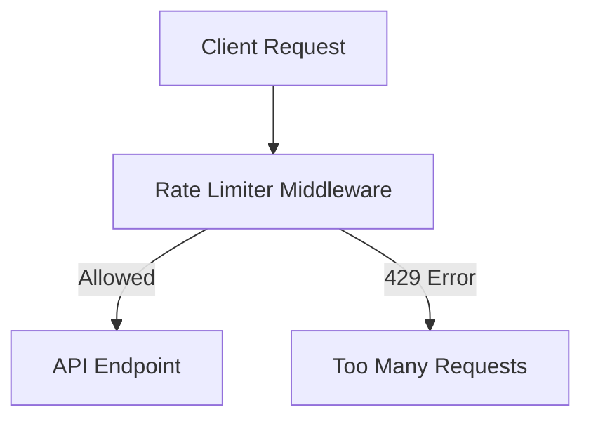

# API Rate Limiter (Node.js)

This project demonstrates a simple backend service in Node.js that limits API requests from a single IP using a sliding time window (max 10 requests per IP per 1 minute).

## Approach
- **Sliding Window Logic:**
  - Each incoming request's timestamp is stored in memory (per IP).
  - On each request, timestamps older than 1 minute are removed.
  - If the number of requests in the last minute exceeds the limit, the request is rejected with HTTP 429.
- **In-Memory Store:**
  - Uses a JavaScript `Map` to store request timestamps for each IP.
  - No external database or cache is required.
- **Endpoints:**
  - `/api/test1` and `/api/test2` for testing the rate limiter.

## How to Run
1. **Install dependencies:**
   ```sh
   npm install
   ```
2. **Start the server (with nodemon for auto-reload):**
   ```sh
   npx nodemon index.js
   ```
3. **Test the endpoints:**
   - Use curl, Postman, or a browser to access:
     - `http://localhost:3000/api/test1`
     - `http://localhost:3000/api/test2`
   - After 10 requests per minute from the same IP, further requests will receive a 429 error.

## Workflow Diagram



**Author: Y sai koushik reddy**